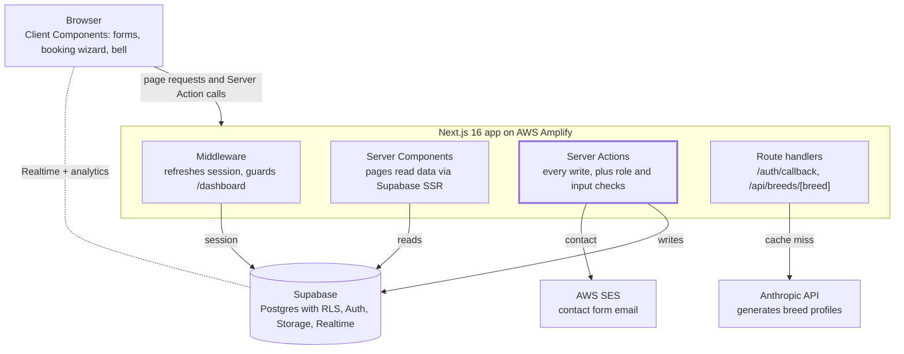

# Technical architecture

PawConnect is a single Next.js application with no separate backend: Server Components read data, Server Actions perform every write, and Supabase enforces access with Row Level Security. Three external services hang off the server side: Supabase, AWS SES and the Anthropic API.

Server Actions (highlighted) are the only write path; the browser talks to Supabase directly only for Realtime updates and analytics events.

## 3.1 Request path

1. **Middleware** (`middleware.ts` calling `lib/supabase/middleware.ts`) runs on every non-static request. It refreshes the Supabase session cookie and applies the redirects in AUTH-08.
2. **Server Components** (pages under `app/`) create a cookie-bound Supabase client (`lib/supabase/server.ts`) and read data directly, so pages render with data already filled in.
3. **Client Components** (`"use client"`: forms, booking wizard, bookings tabs, notifications bell, search filters, share button) call Server Actions or use the browser client (`lib/supabase/client.ts`) for Realtime and analytics.
4. **Server Actions** (`lib/actions/*.ts`) check the user and role, validate input, write to Postgres or Storage, create notifications and call `revalidatePath` to refresh affected pages.
5. **Route handlers** exist only for `/auth/callback` (OAuth and email-link code exchange) and `GET /api/breeds/[breed]`.

## 3.2 Code layout

| Path | Contents |
| --- | --- |
| `app/(auth)/` | Login, signup, forgot password, resend verification, shared auth layout |
| `app/auth/` | OAuth callback route, update-password page |
| `app/dashboard/pet-owner/` | Owner dashboard, pets, bookings, provider search and booking, profile, notifications, settings |
| `app/dashboard/service-provider/` | Provider dashboard, profile, bookings, notifications, settings |
| `app/community/`, `app/breeds/`, `app/search/`, `app/providers/[id]/` | Public feature pages |
| `app/components/` | Header, NavBar, Footer, newsletter, contact form, provider cards, `ui/` primitives |
| `lib/actions/` | Server Actions: auth, pets, profile, providers, bookings, reviews, community, contact, newsletter |
| `lib/data/breeds.ts` | Breed lookup: database cache, Claude generation, placeholder fallback |
| `lib/analytics.ts` | Fire-and-forget event tracker |
| `lib/types/` | Shared types and enums (service types, price units, pet fields, booking status) |
| `supabase/migrations/` | 11 SQL migrations (tables, RLS, buckets, view, Realtime) |

## 3.3 Data model

| Table | Key columns | Relationships | Access (RLS) |
| --- | --- | --- | --- |
| `auth.users` | id, email, `user_metadata.user_type`, `full_name` | Managed by Supabase |  |
| `pet_owner_profiles` | user\_id (unique), display\_name, phone, city, avatar\_url | user\_id → auth.users | Owner writes own; any signed-in user can read |
| `pets` | owner\_id, name, species, breed, health fields, photo\_url | owner\_id → auth.users | Owner only |
| `provider_profiles` | provider\_id (unique), business\_name, service\_type, address, city, pincode, prices, is\_available, lat/lng | provider\_id → auth.users | Public read; provider writes own |
| `provider_availability` | provider\_id, day\_of\_week (0–6), open\_time, close\_time | provider\_id → auth.users | Public read; provider writes own |
| `bookings` | pet\_owner\_id, provider\_id, pet\_id, booking\_date, start\_time, end\_time (text), status, total\_price, notes, cancellation\_reason | provider\_id → provider\_profiles.id; pet\_id → pets | Owner and provider see their own; owner cancels; provider updates status |
| `notifications` | user\_id, booking\_id, type, title, message, is\_read | booking\_id → bookings | Recipient reads and updates; only booking parties insert |
| `provider_reviews` | provider\_id, reviewer\_id, rating 1–5, comment; unique (provider, reviewer) | provider\_id → provider\_profiles.id | Public read; reviewer inserts and deletes own |
| `community_posts` | author\_id, title, content, post\_type, tags | author\_id → auth.users | Public read; author writes, edits, deletes |
| `community_post_replies` | post\_id, author\_id, content (max 1,000) | post\_id → community\_posts | Public read; author writes, edits, deletes |
| `breed_profiles` | breed\_slug, breed\_name, scores, India fields, generated\_by\_ai |  | Public read; signed-in upsert |
| `contact_messages` | name, email, subject, message |  | Public insert only |
| `newsletter_subscribers` | email |  | Insert from site |
| `analytics_events` | event, properties (jsonb), user\_id | user\_id → auth.users | Insert own or anonymous; no reads except service role |

`provider_search_view` joins `provider_profiles` with the average rating and review count, readable by anon and authenticated roles. Realtime publishes `bookings` and `notifications`. Storage buckets `pet-photos`, `provider-avatars` and `pet-owner-avatars` are public-read, owner-write.

## 3.4 Booking lifecycle

A booking starts `pending`. The provider moves it to `confirmed` or `cancelled`; a confirmed booking moves to `completed` or `cancelled`; the owner can cancel while it is `pending` or `confirmed`. Every move writes a notification to the other party, and only `completed` bookings unlock a review.

## 3.5 Integrations

| Integration | How it is called | Failure behaviour |
| --- | --- | --- |
| Supabase Auth | `@supabase/ssr` cookie session; `signUp`, `signInWithPassword`, `signInWithOAuth` (Google), `resetPasswordForEmail`, `exchangeCodeForSession` | Errors shown on the form |
| AWS SES | `SendEmailCommand` from `lib/actions/contact.ts`; HTML and text body, Reply-To = sender; region checked against an allowlist | Form succeeds if DB save or email works |
| Anthropic API | `fetch` to `/v1/messages`, model `claude-3-5-haiku-20241022`, 1,024 max tokens, timeout; JSON parsed and cached to `breed_profiles` | Placeholder breed profile |
| Google Fonts | `next/font/google` (self-hosted at build) | n/a |

## 3.6 Security

- RLS is enabled on every table; the 2026-04-08 hardening migration closed open analytics and notification inserts.
- Server Actions re-check `user_type` (`requirePetOwner`, `requireServiceProvider`) and ownership before writes.
- Uploads are checked for MIME type and size on the server.
- The auth callback rejects absolute and protocol-relative `next` URLs.

## 3.7 Deployment and configuration

The app is hosted on AWS Amplify (per `AWS_SES_SETUP.md`), which supplies AWS credentials through its IAM role. Supabase is a managed project; migrations are applied from `supabase/migrations`. Builds use `npm run build`; there is no CI pipeline or automated test suite in the repo.

## 3.8 Technical debt and risks

| Item | Impact |
| --- | --- |
| `GET /api/breeds/[breed]` is public and calls Claude on any cache miss | Anyone can trigger paid AI calls with made-up breed names; add rate limiting or an allowlist |
| `breed_profiles` lets any signed-in user upsert | A user could overwrite breed content |
| Slot check and insert are not atomic; no unique index on provider + date + time | Two owners can book the same slot at the same moment |
| `updateBookingStatus` does not check the current status | A crafted call could move a cancelled booking back to confirmed |
| Server does not reject past booking dates (only the date picker does) | Bookings in the past are possible via direct calls |
| Provider dashboard rating is hard-coded to 4.8 | Misleading figure |
| Provider booking list names owners `Owner <id prefix>` | Poor UX |
| `nodemailer` installed but unused | Dead dependency |
| No tests, no CI | Regressions go unnoticed |
